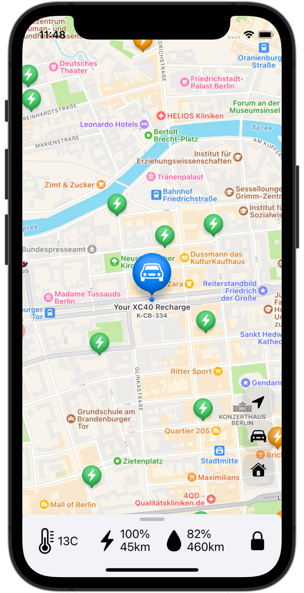

# RideRecharge

## This app let's you
1) See varios information about your car including current location on map, driving journal, average consumption for electic and petrol usage etc
2) Find charging stations in the proximity of your car and their availability
3) Send locations from Google or Apps Maps to the car. Select a point-of-interest or location in the map app, tap Share and select the RideRecharge app as destination.

## How to build and run
1) Download or clone the repo
2) Open the project in Xcode
3) Assign a development team in Project settings
4) Run!

## Compatibility
* The project requires iOS 16 or higher
* Supports Volvo SPA models running the Sensus infotainment (model year 2015-2022). SPA models with Android Automotive infotainment (AAOS) are not supported as they require a different Volvo API.

## Notes
### Charging locations
Showing charging locations requires an key for the ENBW or Tom Tom API. To obtain a key you need to register as developer with ENBW and / or Tom Tom. Once you obtained the API key enter it in the Info.plist (TomTom_API_Key for Tom Tom, ENBW_API_Key for ENBW). The key must be entered both in the app and ShareExtension Info.plist. 
### Google Maps locations
Sharing locations from the Google Maps app requires an Google Maps API key. Once you obtain the key, enter it in the Info.plist (Google_API_Key). The key must be entered both in the app and ShareExtension Info.plist. The API is required to resolve the URL received from the Google Maps into coordinates and address.

